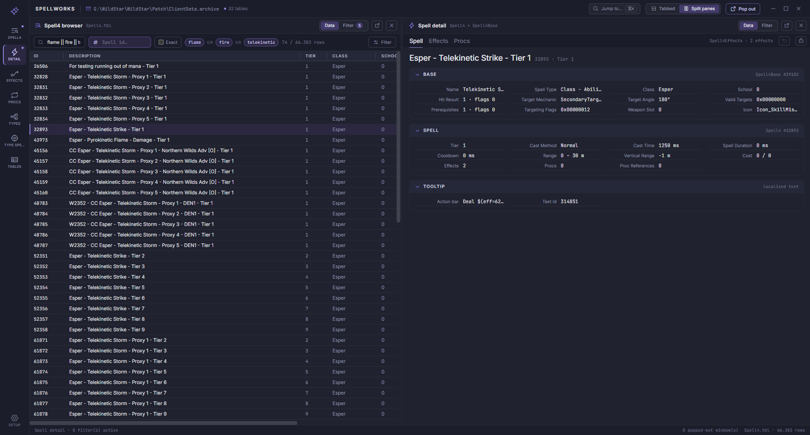
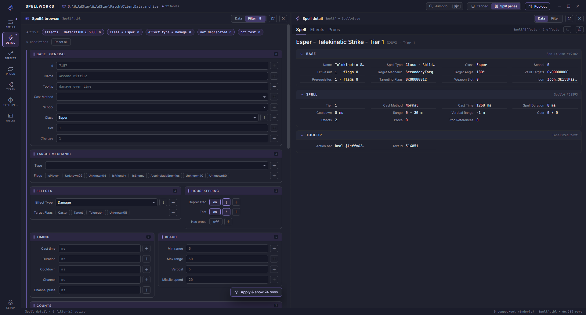

# SpellWorks

**A spell data browser for the defunct MMORPG WildStar.**

SpellWorks reads a WildStar client's `ClientData.archive` and turns the `Spell4` family of game tables
into something you can actually explore - browse, cross-reference and filter tens of thousands of spells,
their effects and their procs without writing a single query.

> **Status:** Feature complete. Tests in active development. Suggest a feature either on Discord or as an issue.



## What it does

### Browse the spell data

Seven purpose-built views, plus a generic one for every other table in the archive:

| View | What it shows                                                                                                                 |
| --- |-------------------------------------------------------------------------------------------------------------------------------|
| **Spell4 browser** | Every spell in `Spell4`, searchable and filterable                                                                            |
| **Spell detail** | One spell resolved across `Spell4` + `Spell4Base` — base, timing, reach, tooltip, effects and procs, as readable cards        |
| **Spell4Effects** | The raw effect rows, typed per effect kind (Damage, Heal, Vital Modifier, Proxy …) so their `DataBits` columns get real names |
| **Proc references** | Proxy effects that fire other spells, and what they point at                                                                  |
| **Effect Types** | Every `SpellEffectType`, with how many spells use it and how many rows they carry between them                                |
| **Effect Type spells** | The reverse look-up - pick an effect type, get every spell that carries one                                                   |
| **Game tables** | The archive index: all loaded tables, each openable as its own grid                                                           |

Detail cards are hyperlinked: an effect's `DataBits` that names a spell gets an **open** button, so
following a proxy chain or a prerequisite spell is one click, not a manual id hunt.

### Flexible Filters, pick what you want to filter from pre-programmed Filters or self defined. 



Every grid has its own filter form built from a per-view schema:

- **Boolean structure without parentheses.** Conditions AND within a block, blocks OR across - the form
  draws precedence as layout. Any condition can be negated with `!`.
- **Typed controls per field.** Text, choice, numeric bounds, on/off toggles, and bitmasks that are either
  typed as decimal/hex or picked bit-by-bit by name.
- **Flex filters.** Beyond the hand-written fields, *any column of any linked row* is filterable - the
  spell row, its base row, its effects, and the linked hit-result, target-mechanic, target-angle,
  prerequisite, valid-target, prerequisite-spell and spell-type rows. Promote a column you use often and
  it becomes a first-class field of the form.
- **Active filter chips** across the top, each removable on its own, with a live "Apply & show N rows"
  count before you commit.
- **Search expressions** in the grid search box: `||`, `&&` and a leading `!`, with an exact-match toggle
  and a separate id box. Malformed input degrades to a literal search instead of erroring mid-keystroke.

### A workspace, not a window

- **Tabbed or split panes**, switched at any time. The same view renders identically either way.
- **Pop-out windows** - detach any pane into its own OS window and put it on another monitor.
- **Multiple detail panes.** Lock a spell detail (or effect-type) pane and the next selection opens
  alongside it instead of replacing it, so two spells can sit side by side.
- **Pinned tables** in the rail, drag-reorderable, for the game tables you keep coming back to.
- **Command palette** (`Ctrl`/`⌘` + `K`) - jump to any view, game table or spell by name or id.
  `Shift`+`Enter` opens it as a pop-out instead.
- **Resizable, persisted columns**, middle-click to close a tab, drag to reorder.
- Everything above - open views, layout, split sizes, pinned tables, column widths, per-pane filters and
  promoted columns - is saved to `Workspace.json` and restored on the next start. Restoring filters and
  promoted columns are each their own switch, and turning one off never deletes what is saved.

## Getting started

1. Build and run:

   ```
   dotnet run --project NexusForever.SpellWorks
   ```

2. On first run the app opens **Setup** and lists the WildStar installations it detected. Pick one, or
   point it at a `Patch` folder yourself - the one containing `ClientData.archive` and `ClientData.index`.
   The choice is written back to `Configuration.json` as `PatchPath`.

3. The archive is read once at startup; from there everything is in memory.

## Built with

.NET 10 · WPF hosting a Blazor `WebView2` front end · [NexusForever.GameTable](https://github.com/NexusForever)
for the `.tbl` readers · `Nexus.Archive` for the client archive.

The engine (`NexusForever.SpellWorks.Core`) is a plain .NET library with no UI dependency - archive
mounting, table cataloguing, spell projection and the whole filter model live there. The WPF/Blazor
project on top is the shell, the layout and the forms.

## License

See [LICENSE](LICENSE).
